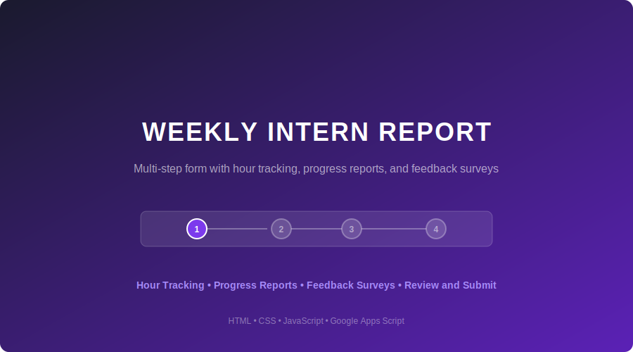

# Weekly Intern Report App

A branded, multi-step web form for managing intern hour tracking, progress reporting, and weekly feedback surveys — built for workforce development and career pathway training programs.



## 🔗 Live Demo

**[Try the live demo →](https://yourusername.github.io/weekly-intern-report-app)**

> All data in the demo is fictional. No submissions are stored or emailed.

---

## Overview

This tool replaces scattered spreadsheets, email chains, and paper forms with a single, polished submission experience. Interns complete a guided 4-step form each week, and program staff receive organized data automatically.

**Built for a real workforce development program** — this app was designed and deployed for a nonprofit internship & mentorship program supporting 30+ participants across multiple career tracks and host organizations.

### What It Does

- **Step 1 — Intern Info**: Captures name, career track, host organization, navigator, and mentor from pre-populated dropdowns
- **Step 2 — Hours & Progress**: Daily hour logging (Mon–Fri required, Sat–Sun optional) with a 15-hour weekly target tracker, plus a progress report (type in or upload a file)
- **Step 3 — Feedback Survey**: Emoji-based pulse check on mentor sessions, host org sessions, and 4 weekly experience questions with conditional follow-up prompts
- **Step 4 — Review & Submit**: Full submission review, confirmation checkbox, and optional email copy request

### Key Features

- **Multi-step form with progress stepper** — guides users through each section without overwhelming them
- **Smart validation** — required fields enforced per section, conditional logic (e.g., below-5 ratings require written feedback), file format/size checking on uploads
- **Emoji-based rating system** — 5-face scale (😞 🙁 😐 😊 😄) with conditional follow-up text boxes
- **Dual progress report submission** — type directly into the form OR upload a PDF/Word file
- **Full review page** — all data from every section displayed before final submission
- **Date auto-fill** — today's date pre-populated for convenience
- **15-hour cap tracking** — visual indicator that turns green (on target) or red (over cap)
- **Responsive design** — works on desktop, tablet, and mobile
- **WCAG accessible** — skip navigation, ARIA labels, focus indicators, high-contrast text, keyboard navigable
- **Legal footer** — authorized use disclaimer, privacy policy links, copyright notice

---

## Tech Stack

| Layer | Technology |
|-------|-----------|
| Frontend | HTML5, CSS3, Vanilla JavaScript |
| Typography | Open Sans (Google Fonts) |
| Backend (when deployed) | Google Apps Script |
| Data Storage | Google Sheets |
| File Storage | Google Drive |
| Email Notifications | Gmail via Apps Script MailApp |
| Hosting (demo) | GitHub Pages |
| Security | HTTPS/TLS (Google-enforced) |

**No frameworks. No build step. No dependencies.** The entire app is a single HTML file — drop it into any hosting environment and it works.

---

## Deployment

This app is designed to deploy on **Google Apps Script** for production use (free, no hosting costs). The deployment connects:

1. **Google Sheets** — every submission saved as a row
2. **Google Drive** — uploaded progress report files stored in a designated folder
3. **Gmail** — automatic email notifications to staff + optional copy to the intern

See **[DEPLOYMENT_GUIDE.md](DEPLOYMENT_GUIDE.md)** for step-by-step setup instructions (beginner-friendly, no terminal required).

---

## File Structure

```
weekly-intern-report-app/
├── index.html              ← The complete form (single-file app)
├── DEPLOYMENT_GUIDE.md     ← Step-by-step Google Apps Script setup
├── LICENSE                 ← MIT License
├── README.md               ← This file
└── assets/
    └── screenshot-preview.svg
```

---

## Customization

This app is designed to be easily customized for any internship, training, or workforce program:

| What to Change | Where |
|---------------|-------|
| Organization name & branding | Header section, logo SVG, footer |
| Career tracks | `<select id="track">` dropdown options |
| Host organizations | `<select id="hostOrg">` dropdown options |
| Navigator / Mentor names | `<select>` dropdown options |
| Contact info | Intro card and footer |
| Brand colors | CSS `:root` variables at the top |
| Survey questions | `SURVEY_QS` array in the `<script>` section |
| Weekly hour target | Change "15" references in HTML and JS |

---

## Design Principles

- **Outline-first** — structure approved before code was written
- **Mobile-responsive** — grid layouts collapse gracefully on small screens
- **Accessibility-first** — ARIA roles, skip links, focus management, color contrast ratios meet WCAG AA
- **Progressive disclosure** — conditional fields only appear when relevant (e.g., mentor feedback only shows after clicking "Yes" to meeting)
- **Validation without frustration** — errors appear inline with clear messages, not blocking alerts

---

## Screenshots

### Step 1 — Intern Information


### Step 2 — Hours & Progress Report
*Daily hour tracking with required/optional distinction and dual progress report submission*

### Step 3 — Feedback Survey
*Emoji-based ratings with conditional follow-up prompts*

### Step 4 — Review & Submit
*Full data review from all sections before final submission*

---

## License

This project is licensed under the **MIT License** — see [LICENSE](LICENSE) for details.

You are free to use, modify, and distribute this app for personal or commercial purposes.

---

## Author

Built as part of a workforce development program coordination role, designing tools for managing 30+ intern participants across multiple career tracks, host organizations, and mentors.

If you're interested in using this tool for your program or need customization, feel free to reach out.
